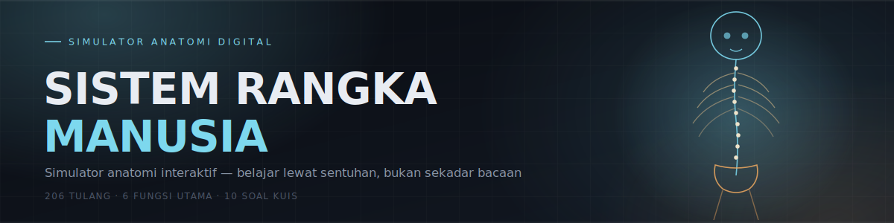

<p align="center">
  
</p>

<h1 align="center">🦴 Sistem Rangka Manusia</h1>
<p align="center"><i>Simulator Anatomi Interaktif</i></p>

<p align="center">
  
  
  
</p>

## Tentang Proyek

**Sistem Rangka Manusia — Simulator Anatomi Interaktif** adalah website edukasi satu halaman yang mengubah materi biologi tentang rangka manusia menjadi pengalaman visual yang bisa disentuh, bukan cuma dihafal. Alih-alih membaca daftar nama tulang di buku teks, pengunjung bisa langsung mengklik tiap bagian pada ilustrasi kerangka SVG untuk melihat nama dan datanya, menyaring tampilan antara rangka aksial dan apendikular, membaca materi lengkap tentang struktur & fungsi tulang, hingga menguji pemahamannya lewat kuis interaktif.

Seluruhnya berjalan sebagai satu file HTML mandiri — tanpa framework, tanpa build step, tanpa dependency eksternal selain font dari Google Fonts.

## ✨ Fitur

- 🖱️ **Simulator kerangka interaktif** — ilustrasi SVG tubuh manusia lengkap dengan hotspot yang bisa diklik: tengkorak, mandibula, tulang belakang, sternum, rusuk, pelvis, klavikula, skapula, humerus, radius, ulna, tulang tangan, femur, patela, tibia, fibula, hingga tulang kaki.
- 🎚️ **Filter Rangka Aksial / Apendikular** — menyorot kelompok tulang secara terpisah untuk memperjelas peta rangka tubuh.
- 📊 **Statistik animasi (count-up)** — 206 tulang dewasa, ±270 tulang saat lahir, 80 tulang rangka aksial, 126 tulang rangka apendikular, 5 kategori bentuk tulang, dan 6 fungsi utama rangka.
- 📚 **Materi lengkap** — enam fungsi rangka, anatomi tulang panjang, sel-sel penyusun tulang (osteoblas, osteosit, osteoklas), klasifikasi tulang berdasarkan bentuk, kurva alami tulang belakang, peta rangka aksial & apendikular, persendian lengkap dengan studi kasus sendi lutut, kelainan tulang (osteoporosis, skoliosis, dll.), hingga nutrisi & kesehatan tulang.
- 🧠 **Kuis interaktif** — 10 soal pilihan ganda seputar sistem rangka lengkap dengan penjelasan tiap jawaban, skor berjalan, progress bar, dan pesan hasil akhir yang berbeda sesuai perolehan skor.
- 🎨 **Desain bertema "phosphor X-ray"** — latar gelap dengan aksen cyan & amber, tipografi Space Grotesk / Source Serif 4 / IBM Plex Mono, animasi scroll-reveal, dan navbar yang bisa dilipat.
- 📱 **Responsif** — nyaman diakses dari desktop maupun mobile.


## 🤖 Dibuat dengan Claude

Seluruh halaman ini — mulai dari penyusunan materi edukasinya, ilustrasi SVG interaktif tiap tulang, logika filter & kuis, sampai desain visualnya — dirancang dan dikodekan melalui percakapan dengan **[Claude](https://claude.ai)**, asisten AI dari [Anthropic](https://www.anthropic.com).

## 📁 Struktur Proyek

```
.
├── index.html    # Aplikasi utama (single-file HTML + CSS + JS)
├── banner.svg    # Banner header README ini
├── README.md
├── LICENSE
└── .gitignore
```

## 📄 Lisensi

Proyek ini dirilis di bawah lisensi [MIT](LICENSE) — bebas digunakan, dimodifikasi, dan dibagikan.

---

<p align="center"><sub>🦴 dibangun bareng Claude</sub></p>
